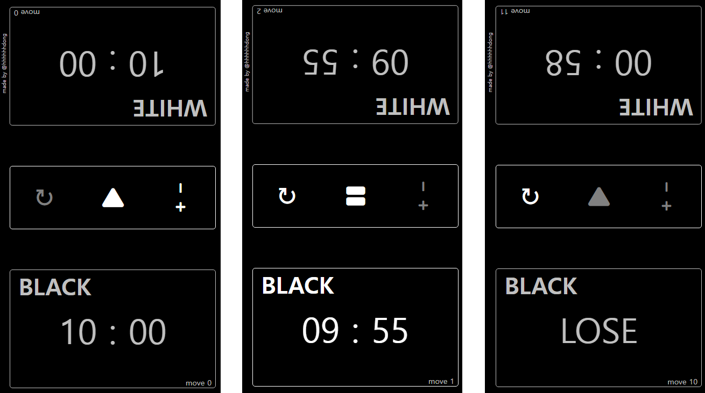
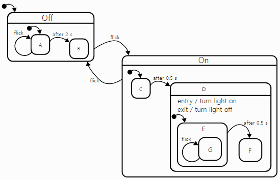
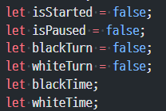
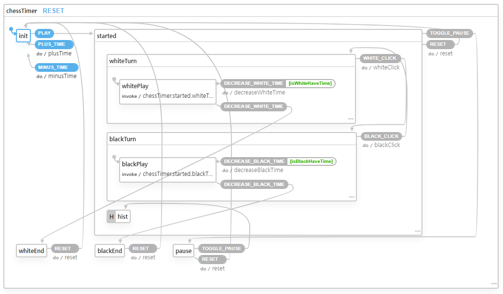

# Chess Timer (with. XState)

## 프로젝트 소개

>배포링크 https://timer-for-chess-xstate.netlify.app/
>
>모바일을 기준으로 만들었으며 웹에서보면 크게 보일 수 있다.

- Chess Timer프로젝트는 예전에 친구들과 취미로 체스를 두다가 체스타이머가 없어서 각자 휴대폰타이머를 사용했었는데 불편함을 느끼고 웹으로 구현해서 사용할려고 만든 프로젝트입니다.
- [예전에 자바스크립트로만 만들었던 체스타이머 프로젝트](https://github.com/hhhhhhdong/chessTimer)를 [XState](https://xstate.js.org/) 상태관리 라이브러리 사용해서 리팩토링했습니다.

### 기능설명

- 게임을 시작전에 `+`,`-` 버튼일 이용해 시간을 설정할 수 있다.
- 플레이 버튼을 클릭하면 `WHITE`부터 시간이 흐르게 되고 `WHITE`가 1수를 두고 자기쪽 버튼을 클릭하면 `BLACK`의 타이머가 흐르면서 턴이 넘어간다.
- 게임 중에는 `reset`버튼으로 초기상태로 돌아갈 수 있고,  `pause`버튼을 이용해 일시정지 할 수 있다.
- 자기 진영 우측하단에 `move`를 통해서 몇 수를 뒀는지 확인 할 수 있다.
- 시간이 초과되면 LOSE가 나오면서 게임이 종료된다. (`reset`기능만 가능)

## XState

- **[XState](https://xstate.js.org/)는 [상태머신](https://ko.wikipedia.org/wiki/%EC%9C%A0%ED%95%9C_%EC%83%81%ED%83%9C_%EA%B8%B0%EA%B3%84/)/ [상태차트](http://www.inf.ed.ac.uk/teaching/courses/seoc/2005_2006/resources/statecharts.pdf)을 이용한 UI 상태관리 라이브러리입니다.**

>#### 상태머신(Finite State Machine)이란?
>
>Finite State Machine (유한상태기계)은 다음의 특징을 가진다.
>
>-	항상 단일 초기 상태를 가집니다.
>-	유한한 개수의 상태를 가집니다.
>-	유한한 개수의 이벤트를 가집니다.
>-	이벤트에 의해 다음 상태로 전환 합니다.
>
> 즉 추상 기계라고 할 수 있으며 하나의 상태(Current State)를 가지며 사건(Event)에 의해 다른 상태로 변화할 수 있으며, 이를 전이(Transition)이라 한다.

> #### 상태차트(statecharts)란?
>
> UI 복잡성 문제의 해결법으로 기존의 상태머신을 통한 모델링의 한계를 해결하기 위해 몇가지 개념을 추가로 도입한 것
>
> 
>
> 상태머신을 다이어그램(state-diagram)으로 만들고 아래의 개념들을 추가한다.
>
> - depth
> - orthogonality(Concurrency) (동시에 독립된 두 가지 상태를 가질 수 있다.)
> - broadcast-communication
>
> 참고자료 http://www.inf.ed.ac.uk/teaching/courses/es/PDFs/lecture_4.pdf

## XState를 사용한 이유

### 1. State Explosion

위 사진은 예전에 자바스크립트로 체스타이머 프로젝트를 진행했을 때 사용했던 Boolean flag 등 변수이다. 위 의 변수만 보더라도 여러가지 상태들이 나올 수 있다.

- 시작 전
- 시작 후
- `BLACK`턴
- `WHITE`턴
- `BLACK`턴 상태에서 `pause` 
- `WHIT`턴 상태에서 `pause`
- `BLACK` 턴 상태에서 시간초과 -> `WHITE` 승리
- `WHITE` 턴 상태에서 시간초과 -> `BLACK` 승리

이런 다양한 상태를 Boolean flag를 이용해서 관리하다보면 `if문`이 중첩되고 점점 코드가 더러워지는 것을 느끼게 된다. 또한 추가적인 로직이 생겼을 때 코드를 수정하기 어렵다.(유지보수 어려움) 
XState를 이용하면 특정상태를 정의할 수 있고 이벤트를 발생시키면서 상태를 변화시키기 때문에 가독성이 좋고 유지보수도 쉬워진다.

사실 XState를 알게되고 처음 들었던 생각이 체스타이머 프로젝트를 리팩토링해보고싶다는 생각이였다.

### 2. UI를 bottom-up 방식이 아닌 Top-down 방식으로 개발할 수 있어진다.
1번 이유와 이어지는 내용일 수도 있다.
일반적으로 데이터 모델링이 중요하다는 것은 알려져 있지만 UI의 동작 모델링에대해서는 쉽게 보는 경향이 있다. 
하지만 UI개발을 하다보면 항상 느끼는 거지만 시작하기 전에 생각했던 것 보다 더 복잡하고 어렵다. 
그런데 bottom-up 방식으로 개발을 진행하다보면 코드가 점점 더러워지고 가독성이 떨어지는 경우가 많다. 

XState는 UI개발을 Top-down 방식으로 개발할 수 있게 해준다. 또한 동작 모델링도 가능하다.

- Chess Timer 프로젝트 상태차트 [[link]](https://xstate.js.org/viz/?gist=ae67a331363b033041b511e3e727ebef)
  

XState에서 제공하는 Visualizer를 통해서 체스타이머 동작모델을 구현한 것 이다. Visualizer통해서 실행도 해볼 수 있다.
이런식으로 먼저 UI의 동작에 대해서 설계하고 테스트를 한다음에 개발을 시작하는 것이 가능하기때문에 코드가 한결 간결해 진다.

### 3. 컴포넌트를 동작모델과 따로 분리해서 관리할 수 있다.
동작모델과 컴포넌트가 따로 분리되기 때문에 여러가지 이점이 있다.
- 동작모델과 컴포넌트를 따로 관리할 수 있다.
- 동작 모델을 컴포넌트와 관계없이 독립적으로 테스트 가능
- 코드를 더 쉽게 추론할 수 있다.

### 4. 협업
가장 중요한 부분이 아닐까 생각한다.
XState를 이용해서 동작모델을 먼저 설계하고 Visualizer를 통해서 시각화를 한다면 팀 커뮤니케이션 할 때 많은 도움이 될 것으로 생각된다.
핵심 동작을 기획단계에서부터 함께 모델링할 수 있고 시각화를 통해 복잡한 동작을 함께 검증할 수 있다. 이를 통해 비개발자분들은 개발단계를 이해하기 쉬워지고 개발자입장에서는 좀 더 서비스 관점에서 생각할 수 있게된다.

## 느낀점

XState에대해서 비판하는 사람들도 많다. 그들의 이야기를 정리해보면 
- 필요이상으로 상태관리가 복잡해 지는 경우가 생긴다. (배보다 배꼽이 크다)
- 모든 동작들을 미리 예상하고 설계하는 것은 어렵다.
- 프로젝트 진행 도중에는 적용하기가 어렵다.

사실 사용하면서 위의 이야기들에 충분히 공감을 했다. 더 큰 프로젝트의 경우 모든 UI의 상태를 예상하고 설계해서 관리하기에는 힘들지 않을까라는 생각을 했다.
하지만 어느 정도 적당한 규모의 프로젝트 또는 팀 커뮤니케이션이 중요한 경우에는 충분히 고려해 볼 수 있고 적용하기에는 좋은 라이브러리라고 생각한다. 또한 실제 프로젝트상에서는 다른 상태관리 라이브러리를 사용하더라도 커뮤니케이션을 위해 간단하게 상태차트를 구현해보는 것도 많은 도움이 되지 않을까 생각한다.
실제로 이번 프로젝트를 진행하면서 머리속에 뒤죽박죽이던 동작모델을 논리적으로 구현하고 시각화해 봄으로써 앞으로 UI개발을 하는데 많은 도움이 되지않을까 생각한다.

----

참고자료

https://xstate.js.org/docs/

https://egghead.io/lessons/xstate-recall-previous-states-with-xstate-history-states-nodes

https://en.wikipedia.org/wiki/UML_state_machine

https://statecharts.dev/on-off-statechart.html

https://css-tricks.com/using-react-and-xstate-to-build-a-sign-in-form/

http://www.inf.ed.ac.uk/teaching/courses/seoc/2005_2006/resources/statecharts.pdf
